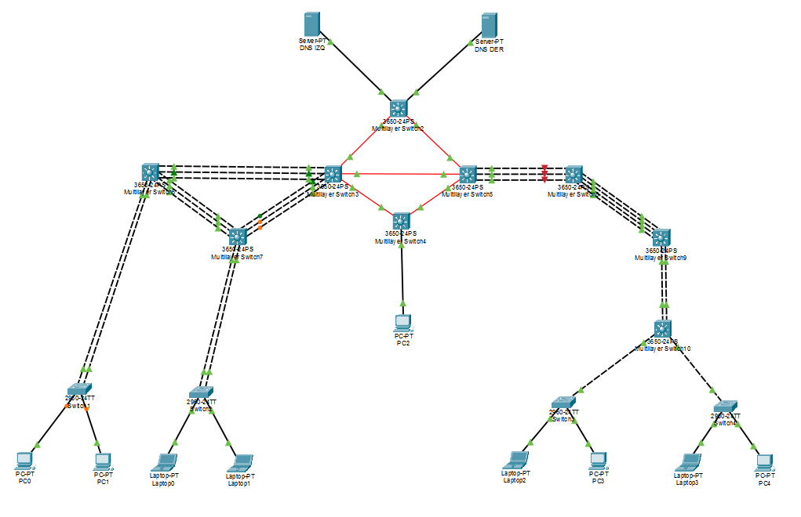
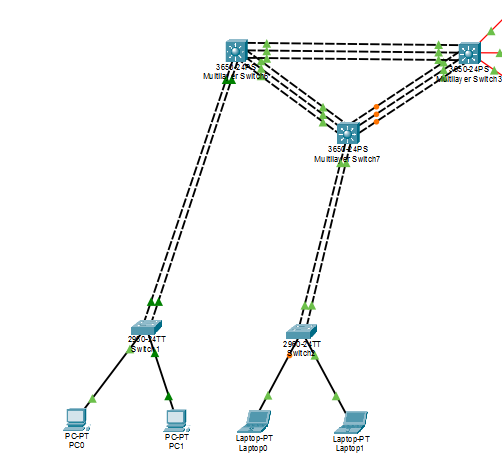
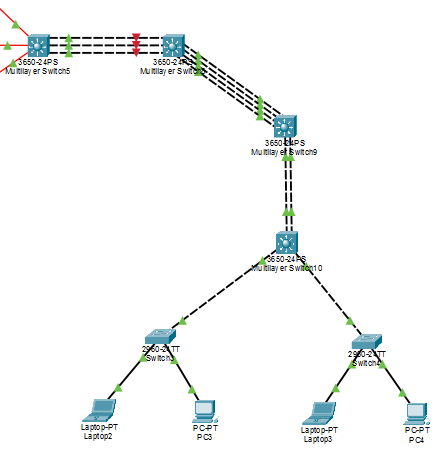
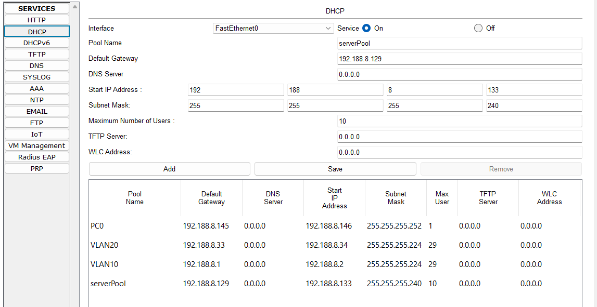
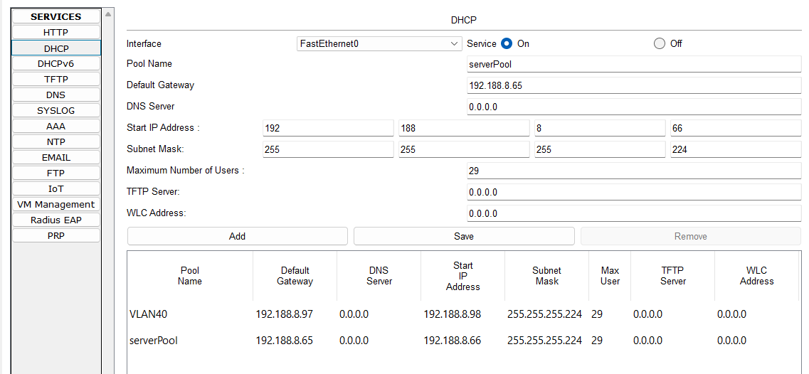

# Proyecto 1 — Chapin Red (REDES2_1S2026_201901108)

Manual técnico del proyecto: diseño de direccionamiento (VLSM/FLSM), Capa 2 (VTP/VLANs/STP/LACP/PAgP) y Capa 3 (OSPF/DHCP/ACLs).

## 📷 Topología general (Red MAN)



---

## Fase 1: Diseño de Direccionamiento IP (VLSM y FLSM)

Redes base asignadas según el carné (201901108 → **08**):
- `192.188.8.0/24` → VLANs de usuarios (subnetting **VLSM**)
- `10.4.8.0/24` → enlaces de enrutamiento entre routers/switches multicapa (subnetting **FLSM**)

### VLSM en `192.188.8.0/24` — por qué cada VLAN tiene el tamaño que tiene

VLSM (Variable Length Subnet Mask) significa dividir el bloque en subredes de **distinto tamaño**, cada una ajustada a lo que realmente necesita — ni más (desperdicio de IPs) ni menos (se queda corta si crece el departamento). El procedimiento correcto es: primero se listan todas las subredes requeridas, se ordenan de mayor a menor cantidad de hosts necesarios, y se van asignando bloques del más grande al más chico dentro del espacio disponible.

| VLAN | Departamento | Host bits | Tamaño | Hosts usables | Por qué ese tamaño |
|---|---|---|---|---|---|
| 10 | Naranja Izq (Proyectos) | 5 | /27 (32 IPs) | 30 | Departamento de usuarios — hoy tiene pocos equipos (PCs/laptops), pero se le da margen de crecimiento (contratación de más personal, más equipos) sin tener que volver a diseñar la subred. |
| 20 | Verde Izq (Coordinación) | 5 | /27 (32 IPs) | 30 | Mismo criterio que VLAN 10: departamento de usuarios con proyección de crecimiento. |
| 30 | Naranja Der (Proyectos) | 5 | /27 (32 IPs) | 30 | Mismo criterio, espejo de VLAN 10 en el edificio derecho. |
| 40 | Verde Der (Coordinación) | 5 | /27 (32 IPs) | 30 | Mismo criterio, espejo de VLAN 20 en el edificio derecho. |
| 99 | Admin (Gestión/Infraestructura) | 4 | /28 (16 IPs) | 14 | **Ver justificación abajo — se le asignó menos a propósito.** |

**¿Por qué la VLAN ADMIN debe tener menos direcciones que las VLANs de usuarios?**

1. **No es un departamento que crece con personal.** Aloja únicamente equipos de infraestructura fijos y conocidos de antemano: 2 servidores DHCP y la PC de administración (PC-ADMIN). No hay una plantilla de empleados que vaya a aumentar ahí como sí puede pasar en Proyectos o Coordinación.
2. **Principio de seguridad / superficie de ataque mínima.** Según la política de ACLs del proyecto, la VLAN ADMIN es la única que puede iniciar comunicación hacia **todas** las demás VLANs. Justamente por tener privilegios elevados, conviene mantenerla lo más pequeña y controlada posible — menos direcciones, menos dispositivos, más fácil de auditar y monitorear.
3. **Eficiencia de direccionamiento (el objetivo real de VLSM).** Darle una subred igual de grande que a las VLANs de usuarios (`/27`) habría desperdiciado 16 direcciones que nunca se van a usar. Esa lógica se comprobó en la práctica: durante la implementación se necesitó una subred adicional pequeña (`192.188.8.144/30`) para la PC de administración del switch `BB-INFERIOR` — ese espacio solo estaba disponible **porque** el diseño original no gastó todo el bloque `/24` de más en VLANs sobredimensionadas.

Con esta distribución, el bloque `192.188.8.0/24` queda así:

```
192.188.8.0   /27  → VLAN 10 (usada: .0 - .31)
192.188.8.32  /27  → VLAN 20 (usada: .32 - .63)
192.188.8.64  /27  → VLAN 30 (usada: .64 - .95)
192.188.8.96  /27  → VLAN 40 (usada: .96 - .127)
192.188.8.128 /28  → VLAN 99 (usada: .128 - .143)
192.188.8.144 - .255  → LIBRE (reservado para crecimiento futuro; de aquí salió la subred de PC-ADMIN)
```

### FLSM en `10.4.8.0/24` — por qué aquí SÍ se usa una máscara fija

FLSM (Fixed Length Subnet Mask) es lo opuesto a VLSM: se divide el bloque en subredes **todas del mismo tamaño**. Se usa cuando **todas** las subredes necesitan exactamente la misma cantidad de hosts — no hay nada que optimizar variando el tamaño.

Ese es exactamente el caso de los enlaces punto a punto entre los switches multicapa (backbone MAN): cada enlace conecta a **dos routers, y solo dos** — siempre necesita exactamente 2 direcciones IP usables, ni una más ni una menos, sin importar cuál enlace sea. Por eso:

- Se fija la máscara `/30` (4 direcciones: red, broadcast y 2 usables) para **todos** los enlaces por igual.
- Usar VLSM aquí no aportaría nada: no existe un enlace que necesite "más hosts" que otro, así que variar el tamaño solo complicaría la documentación sin ahorrar una sola IP.
- Se usó `/30` (el estándar más común y compatible en Cisco) en lugar de `/31` (que da exactamente 2 IPs sin desperdicio, pero requiere que el equipo lo soporte explícitamente) porque `10.4.8.0/24` tiene de sobra (256 direcciones) para los 5 enlaces del backbone (20 direcciones en total) — no hay presión de espacio que justifique esa optimización adicional.

| Enlace | Red /30 | IP A | IP B |
|---|---|---|---|
| BB-SUPERIOR ↔ BB-IZQUIERDO | 10.4.8.0/30 | .1 | .2 |
| BB-SUPERIOR ↔ BB-DERECHO | 10.4.8.4/30 | .5 | .6 |
| BB-IZQUIERDO ↔ BB-INFERIOR | 10.4.8.12/30 | .13 | .14 |
| BB-DERECHO ↔ BB-INFERIOR | 10.4.8.16/30 | .17 | .18 |
| BB-IZQUIERDO ↔ BB-DERECHO | 10.4.8.20/30 | .21 | .22 |


---

## Fase 2: Configuración Capa 2 (VTP, VLANs, STP, LACP y PAgP)

### 📷 Topología — Edificio Izquierdo



### 📷 Topología — Edificio Derecho



### Parámetros VTP
- **Dominio:** CHAPIN_RED
- **Contraseña:** usac2026
- **Versión:** 2
- **Modo Servidor:** MSW-BB-SUPERIOR
- **Modo Cliente:** Todos los demás switches

### VLANs Creadas
| ID | Nombre | Estado |
|----|--------|--------|
| 10 | VLAN_Naranja_EdificioIZQ_201901108 | Active |
| 20 | VLAN_Verde_EdificioIZQ_201901108 | Active |
| 30 | VLAN_Naranja_EdificioDER_201901108 | Active |
| 40 | VLAN_Verde_EdificioDER_201901108 | Active |
| 99 | VLAN_ADMIN_201901108 | Active |

### Verificación de Sincronización
- Revision Number sincronizada: 21
- MD5 Digest coincidente en Server y Clientes
- Rapid-PVST+ habilitado en todos los dispositivos

### EtherChannels

**LACP (edificio izquierdo, 5 enlaces, Capa 2):**

| Port-channel | Entre | Modo |
|---|---|---|
| Po1 | BB-IZQUIERDO ↔ SW-CORE-IZQ-1 | active/active |
| Po2 | BB-IZQUIERDO ↔ SW-CORE-IZQ-2 | active/active |
| Po3 | SW-CORE-IZQ-1 ↔ SW-CORE-IZQ-2 | active/active |
| Po4 | SW-CORE-IZQ-1 ↔ SW-ACC-A | active/active |
| Po5 | SW-CORE-IZQ-2 ↔ SW-ACC-B | active/active |

**PAgP (edificio derecho, 3 enlaces, Capa 2):**

| Port-channel | Entre | Modo |
|---|---|---|
| Po1 | BB-DERECHO ↔ SW-PRINC-DER | desirable/auto |
| Po2 | SW-PRINC-DER ↔ SW-SEC-DER | desirable/desirable |
| Po3 | SW-SEC-DER ↔ SW-DIST-DER | desirable/desirable |

### Comandos principales utilizados (Fase 2)

```
! --- VTP (una sola vez, por switch) ---
vtp domain CHAPIN_RED
vtp password usac2026
vtp version 2
vtp mode server        ! solo en MSW-BB-SUPERIOR
vtp mode client         ! en el resto

! --- Creación de VLANs (solo en el VTP server) ---
vlan 10
 name VLAN_Naranja_EdificioIZQ_201901108
vlan 20
 name VLAN_Verde_EdificioIZQ_201901108
vlan 30
 name VLAN_Naranja_EdificioDER_201901108
vlan 40
 name VLAN_Verde_EdificioDER_201901108
vlan 99
 name VLAN_ADMIN_201901108

! --- Spanning Tree (global, todos los switches) ---
spanning-tree mode rapid-pvst

! --- Puertos trunk (backbone y entre capas) ---
interface GigabitEthernet1/1/1
 switchport trunk native vlan 99
 switchport trunk allowed vlan 10,20,30,40,99
 switchport mode trunk

! --- EtherChannel LACP (edificio izquierdo) ---
interface range GigabitEthernet1/0/10-12
 switchport trunk native vlan 99
 switchport trunk allowed vlan 10,20,30,40,99
 switchport mode trunk
 speed 1000
 channel-group 1 mode active

! --- EtherChannel PAgP (edificio derecho, lado "activo") ---
interface range GigabitEthernet1/0/1-3
 switchport trunk native vlan 99
 switchport trunk allowed vlan 10,20,30,40,99
 switchport mode trunk
 channel-group 1 mode desirable
! --- lado "pasivo" del mismo enlace ---
 channel-group 1 mode auto

! --- Puertos de acceso a PCs/Laptops ---
interface FastEthernet0/1
 switchport mode access
 switchport access vlan 10
 spanning-tree portfast
```

---

## Fase 3: Capa 3 — OSPF, DHCP y ACLs

Carné: **201901108** → últimos dos dígitos **08 (par)** → protocolo de enrutamiento dinámico: **OSPF** (proceso 1, área 0 única) para toda la red (Red MAN entre edificios e inter-VLAN dentro de cada edificio).

### Diseño de Capa 3 (dónde vive cada SVI)

Los switches de Core/Distribución (SW-CORE-IZQ-1, SW-CORE-IZQ-2, SW-PRINC-DER, SW-SEC-DER, SW-DIST-DER) se dejaron **100% Capa 2** — los enlaces LACP y PAgP son trunks, cumpliendo el requisito de la rúbrica. El ruteo (SVI + OSPF) se concentra en los 4 switches backbone (BB-*), que son los únicos con salida ruteada hacia el resto de la red:

| VLAN | Gateway / SVI en | Enrutamiento inter-VLAN vía |
|---|---|---|
| 10, 20 (Naranja/Verde Izq) | MSW-BB-IZQUIERDO | OSPF |
| 30, 40 (Naranja/Verde Der) | MSW-BB-DERECHO | OSPF |
| 99 — Admin (DHCP1, DHCP2) | MSW-BB-SUPERIOR | OSPF |
| 99 — Admin (PC0 / mini-subred) | MSW-BB-INFERIOR | OSPF (subred propia) |

### Mapeo real de puertos (confirmado con `show cdp neighbors`)

| Switch | Gi1/1/1 | Gi1/1/2 | Gi1/1/3 |
|---|---|---|---|
| MSW-BB-SUPERIOR | → IZQUIERDO | → DERECHO | *(no conecta, shutdown)* |
| MSW-BB-IZQUIERDO | → SUPERIOR | → INFERIOR | → DERECHO |
| MSW-BB-DERECHO | → SUPERIOR | → INFERIOR | → IZQUIERDO |
| MSW-BB-INFERIOR | → IZQUIERDO | → DERECHO | *(no conecta, shutdown)* |

### OSPF — resumen de configuración por switch

- Proceso: `router ospf 1`, área `0` única.
- `ip routing` habilitado en los 4 switches backbone (viene apagado por default en un switch multicapa).
- `passive-interface default` + `no passive-interface` solo en las interfaces ruteadas hacia otro switch backbone (las SVI de usuario quedan pasivas, se anuncian pero no mandan Hello).
- Router-ID manual: BB-SUPERIOR `0.0.0.1`, BB-IZQUIERDO `0.0.0.2`, BB-DERECHO `0.0.0.3`, BB-INFERIOR `0.0.0.4`.
- Adyacencias verificadas `FULL` en los 4 switches (`show ip ospf neighbor`).

### DHCP

- **DHCP Relay:** `ip helper-address` configurado en las SVI de VLAN 10, 20 (BB-IZQUIERDO → apunta a `192.188.8.130`), VLAN 30, 40 (BB-DERECHO → apunta a `192.188.8.131`) y en la SVI Admin-INF (BB-INFERIOR → apunta a `192.188.8.130`).
- VLAN 99 (BB-SUPERIOR) no necesita relay: los servidores están en el mismo segmento de Capa 2 que la SVI.
- **Servidor DHCP-IZQ** (`192.188.8.130`, conectado a BB-SUPERIOR Gi1/0/1): pools para VLAN10, VLAN20, VLAN99 (admin general) y Admin-INF (PC0).
- **Servidor DHCP-DER** (`192.188.8.131`, conectado a BB-SUPERIOR Gi1/0/2): pools para VLAN30 y VLAN40.
- PC-ADMIN (PC0) queda por **DHCP obligatorio** (no estático), dentro de la mini-subred Admin-INF, según requisito de la rúbrica.

### 📷 Pools DHCP




### ACLs — política de comunicación entre VLANs

Aplicadas como ACL extendida nombrada, **entrante (`in`)** en cada SVI de usuario (para filtrar el tráfico apenas entra al router desde esa VLAN):

| VLAN origen | Permite hacia | Bloquea hacia |
|---|---|---|
| 10 (Naranja Izq) | VLAN 30 (Naranja Der) | VLAN 20, VLAN 40, VLAN 99, Admin-INF |
| 20 (Verde Izq) | VLAN 40 (Verde Der) | VLAN 10, VLAN 30, VLAN 99, Admin-INF |
| 30 (Naranja Der) | VLAN 10 (Naranja Izq) | VLAN 20, VLAN 40, VLAN 99, Admin-INF |
| 40 (Verde Der) | VLAN 20 (Verde Izq) | VLAN 10, VLAN 30, VLAN 99, Admin-INF |
| 99 / Admin-INF | Todas (sin ACL de salida) | — |

**Control unidireccional de Admin:** ninguna VLAN de usuario puede *iniciar* tráfico hacia VLAN 99/Admin-INF, pero si Admin inicia una conexión, la respuesta sí puede volver — se logra permitiendo explícitamente `icmp ... echo-reply` y `tcp ... established` desde cada VLAN hacia Admin, y bloqueando todo lo demás.

**Excepción obligatoria:** cada ACL permite `udp ... eq 67/68` (DHCP) **antes** de cualquier bloqueo — si no, el DHCP Discover se descarta antes de llegar al `ip helper-address` y se rompe la asignación dinámica de IP.

Nombres de ACL: `ACL_VLAN10`, `ACL_VLAN20` (en BB-IZQUIERDO), `ACL_VLAN30`, `ACL_VLAN40` (en BB-DERECHO).

### Comandos principales utilizados (Fase 3)

```
! --- Habilitar ruteo (switches multicapa lo traen apagado) ---
ip routing

! --- Interfaces ruteadas del backbone (Red MAN) ---
interface GigabitEthernet1/1/X
 no switchport
 ip address <ip> <mascara>
 no shutdown

! --- SVI de VLAN con DHCP relay ---
interface VlanXX
 ip address <ip> <mascara>
 ip helper-address <ip-servidor-dhcp>
 no shutdown

! --- OSPF ---
router ospf 1
 router-id <id>
 passive-interface default
 no passive-interface <interfaz-ruteada>
 network <red> <wildcard> area 0

! --- ACL extendida por VLAN ---
ip access-list extended ACL_VLANXX
 permit udp any eq 68 any eq 67
 permit udp any eq 67 any eq 68
 permit ip <red-origen> <wildcard> <red-destino-mismo-color> <wildcard>
 permit icmp <red-origen> <wildcard> <red-admin> <wildcard> echo-reply
 permit tcp <red-origen> <wildcard> <red-admin> <wildcard> established
 deny ip <red-origen> <wildcard> <red-bloqueada> <wildcard>
 deny ip any any

! --- Aplicar la ACL a la interfaz ---
interface VlanXX
 ip access-group ACL_VLANXX in
```

---